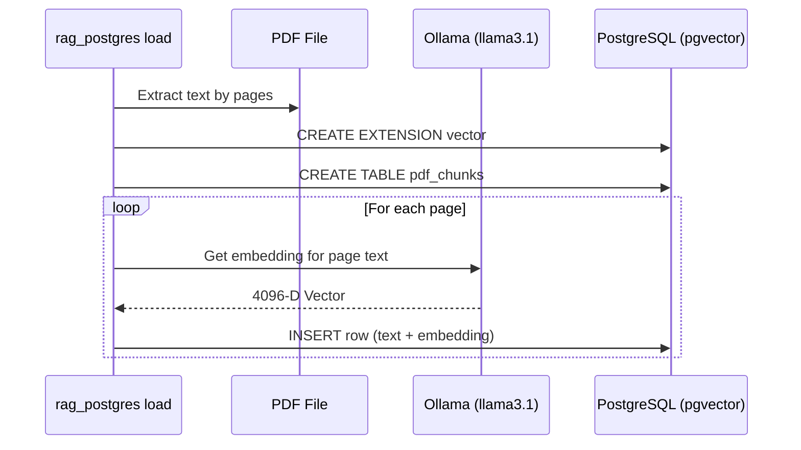
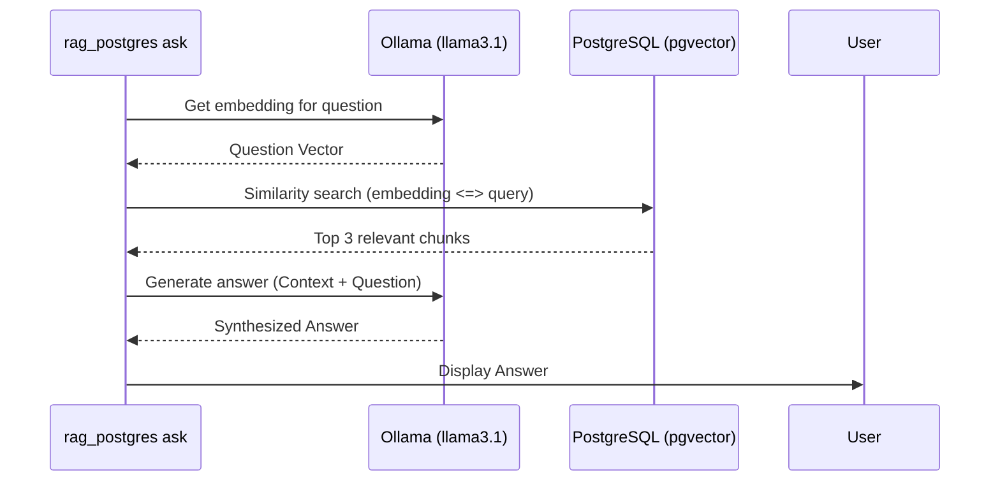

# RAG Sample: Introduction to PDF Retrieval with PostgreSQL (`pgvector`)

## Overview

This sample demonstrates a full Rust-based Retrieval-Augmented Generation (RAG) workflow that:
- loads PDF text and generates vector embeddings for each page using Ollama,
- stores extracted page content and embeddings in PostgreSQL with the `pgvector` extension,
- performs semantic vector similarity search to retrieve relevant chunks for a question,
- synthesizes a final answer using an LLM.

The PostgreSQL server and Ollama service should be running locally. The Rust workspace includes the `rag_postgres` module for loading and querying data.

## What This Project Does

- Starts a local PostgreSQL service with Docker Compose
- Uses Ollama (`llama3.1`) to generate embeddings for document chunks
- Creates a `pdf_chunks` table with a `vector(4096)` column
- Inserts PDF page chunks and their embeddings into PostgreSQL
- Performs semantic search using `pgvector` distance operators
- Generates a natural language answer using an LLM via Ollama

## Plan

1. Add a new Rust workspace member named `rag_postgres`.
2. Add necessary dependencies, including `tokio-postgres`.
3. Add a Docker Compose configuration for PostgreSQL with `pgvector`.
4. Implement `rag_postgres/src/main.rs` with two modes:
   - `load <path-to-pdf>`: read the PDF and insert page chunks into PostgreSQL
   - `ask "<question>"`: retrieve relevant PDF chunks from PostgreSQL
5. Update documentation with instructions and sample commands.

## How It Works

### Loading Process

When you run the `load` command, the application performs the following steps:
1. **Text Extraction**: Uses `pdf-extract` to read the PDF file and split it into individual pages.
2. **Schema Bootstrap**: Connects to PostgreSQL, enables the `vector` extension, and ensures `pdf_chunks` exists.
3. **Embedding Generation**: For each page, sends page text to Ollama (`llama3.1`) to generate a 4096-dimensional vector embedding.
4. **Storage**: Inserts source metadata, page content, and embeddings into PostgreSQL.



### Querying Process (RAG)

When you run the `ask` command, the application executes the RAG workflow:
1. **Question Embedding**: Generates a vector embedding for your question using Ollama.
2. **Semantic Search**: Queries PostgreSQL with `ORDER BY embedding <=> $1::vector LIMIT 3` to get top relevant chunks.
3. **Context Construction**: Combines the retrieved text chunks into one context block.
4. **Answer Synthesis**: Sends context and question to Ollama for grounded answer generation.



## Setup

### Start Services
1. Start PostgreSQL from the repository root:
```bash
docker compose up -d postgres
```
2. Ensure Ollama is running and has the `llama3.1` model:
```bash
ollama run llama3.1
```

### Load a PDF
```bash
cargo run -p rag_postgres -- load path/to/document.pdf
```

### Sample PDF
Use the included sample file:
```bash
cargo run -p rag_postgres -- load data/the-tale-of-peter-rabbit.pdf
```

### Ask a Question
```bash
cargo run -p rag_postgres -- ask "Who is Peter?"
```

## Notes

- The sample uses PostgreSQL with the `pgvector` extension and `vector(4096)` embeddings.
- Similarity search is done with `pgvector` distance ordering (`<=>`).
- The final answer is generated by an LLM (`llama3.1` via Ollama) using retrieved context.

## File Structure

```
rag_postgres/
├── Cargo.toml
└── src/
    └── main.rs
```