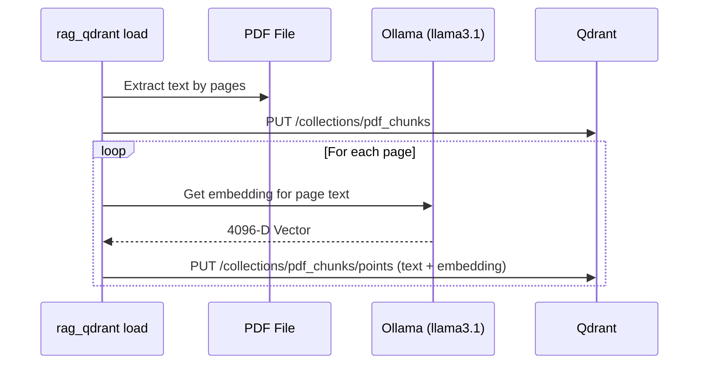
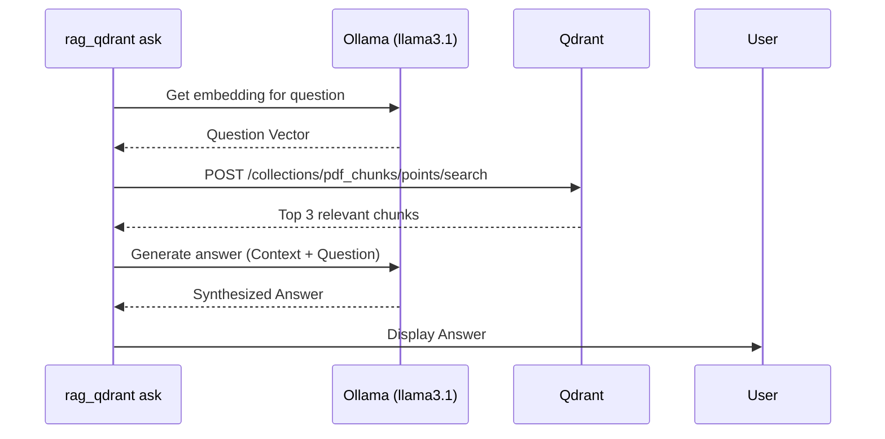

# RAG Sample: Introduction to PDF Retrieval with Qdrant

## Overview

This sample demonstrates a full Rust-based Retrieval-Augmented Generation (RAG) workflow that:
- loads PDF text and generates vector embeddings for each page using Ollama,
- stores the extracted page content and embeddings in Qdrant,
- performs semantic vector search to retrieve relevant chunks for a question,
- synthesizes a final answer using an LLM.

The Qdrant server and Ollama service should be running locally. The Rust workspace includes the `rag_qdrant` module for loading and querying data.

## What This Project Does

- Starts a local Qdrant service with Docker Compose
- Uses Ollama (llama3.1) to generate embeddings for document chunks
- Inserts PDF page chunks and their embeddings into Qdrant
- Performs semantic search using Qdrant's vector search
- Generates a natural language answer using an LLM via Ollama

## Plan

1. Add a new Rust workspace member named `rag_qdrant`.
2. Add `pdf-extract` and `uuid` to the workspace dependencies.
3. Create a Docker Compose configuration for Qdrant.
4. Implement `rag_qdrant/src/main.rs` with two modes:
   - `load <path-to-pdf>`: read the PDF and insert page chunks into Qdrant
   - `ask "<question>"`: retrieve relevant PDF chunks from Qdrant
5. Update documentation with the instructions and sample commands.

## How It Works

### Loading Process

When you run the `load` command, the application performs the following steps:
1. **Text Extraction**: Uses `pdf-extract` to read the PDF file and split it into individual pages.
2. **Indexing**: Ensures a collection is defined in Qdrant with the appropriate vector size and distance metric (Cosine).
3. **Embedding Generation**: For each page, it sends the text to Ollama (`llama3.1`) to generate a 4096-dimensional vector embedding.
4. **Storage**: Stores the page text, metadata (source file, page number), and the embedding as a point in Qdrant.



### Querying Process (RAG)

When you run the `ask` command, the application executes the RAG workflow:
1. **Question Embedding**: Generates a vector embedding for your question using Ollama.
2. **Semantic Search**: Performs a search in Qdrant to find the top 3 most relevant text chunks based on vector distance.
3. **Context Construction**: Combines the retrieved text chunks into a single context block.
4. **Answer Synthesis**: Sends the context and your question to Ollama. The LLM uses the provided context to generate a factual answer.



## Setup

### Start Services
1. Start Qdrant from the repository root:
```bash
docker compose up -d qdrant
```
2. Access the Qdrant Web UI:
Open [http://localhost:6333/dashboard](http://localhost:6333/dashboard) in your browser.

3. Ensure Ollama is running and has the `llama3.1` model:
```bash
ollama run llama3.1
```

### Load a PDF
```bash
cargo run -p rag_qdrant -- load path/to/document.pdf
```

### Sample PDF
Use the included sample file:
```bash
cargo run -p rag_qdrant -- load data/the-tale-of-peter-rabbit.pdf
```

### Ask a Question
```bash
cargo run -p rag_qdrant -- ask "Who is Peter?"
```

## Notes

- The sample uses vector embeddings (4096-D) for semantic retrieval.
- It leverages Qdrant's efficient similarity search.
- The final answer is generated by an LLM (llama3.1 via Ollama) using the retrieved context.
- The collection name is `pdf_chunks`.

## File Structure

```
rag_qdrant/
├── Cargo.toml
└── src/
    └── main.rs
```

## Next Steps

- Implement chunking strategies (e.g., fixed-size with overlap) instead of page-level chunks.
- Add support for multiple PDF documents and filtered search.
- Explore hybrid search (combining full-text and vector search) for better accuracy.